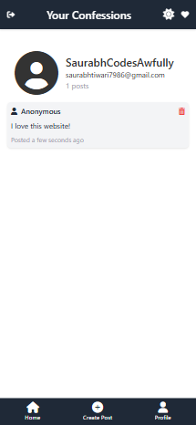

  

<h1 align="center">Confessions</h1>

Confessions is a platform that allows users to anonymously confess their thoughts, feelings, and experiences without fear of judgment or exposure. Designed with a clean, mobile-first user interface, Confessions offers a secure and private space for users to share their confessions freely. Everything is securely stored in Firebase, ensuring complete anonymity.

  
  
  
  
  
  

## 🚀 Project Vision

<strong>Confessions</strong> is a space where people can share their thoughts and feelings freely, without the fear of being judged or exposed. The platform ensures complete anonymity, giving users a safe environment to express themselves. With a clean UI optimized for mobile devices, users can quickly and easily submit, delete, and manage their anonymous confessions.

---

## ✨ Live Website

Confessions is live and available for anyone to use! Share your thoughts anonymously and browse other confessions.

- **Website**: [Confessions](https://confessit.pythonanywhere.com/)
  

  
  
  

  
  
  

---

## 🖥️ Technology Stack

- **Frontend**: HTML, CSS, and JavaScript for a responsive, modern user interface, especially optimized for mobile devices.
- **Backend**: Flask to handle backend logic and manage user interactions.
- **Authentication**: Firebase for secure Google Sign-In and authentication.
- **Database**: Firebase for securely storing all user data and confessions with encryption.
- **Deployment**: Hosted on [PythonAnywhere](https://confessit.pythonanywhere.com) for reliable access.

---

## 🌐 Accessing the Website
You can visit *Confessions* at [Confessions](https://confessit.pythonanywhere.com/).

---

## 🆕 Update 1.0

Here are the key updates in version 1.0 of Confessions:

- **UI Enhancements**: The user interface has been significantly improved, focusing on ease of use, mobile responsiveness, and a clean, modern design.
- **Post Timestamps**: All confessions now have timestamps, showing the date and time each post was made for better context.
- **Dark Mode Toggle**: Users can now toggle between dark and light modes for a more customizable and comfortable experience.
- **Character Limit and Live Counter (500 Characters)**: The confession text box now includes a live character counter that limits the confession to 300 characters, ensuring concise and readable posts.
- **Live Confession Preview**: As users type their confession, they can preview it live, ensuring that everything looks as intended before posting.
- **Draft Confessions**: Users can now save their confessions as drafts and come back to them later before posting them publicly.
- **Unique User ID and Username**: Each user is now assigned a unique ID, and they can create a personalized username for their profile.
- **Profile Tab**: The Profile tab now displays the user’s username, the number of posts they’ve made, and their email address, providing more insight into their activity on the platform.

Stay tuned for more updates and improvements in the upcoming versions!

## 🚀 Future Plans

The future of *Confessions* is bright! Here’s what we’re planning:

- **Social Media Features**: Introducing features like comments, likes, and sharing posts (similar to platforms like Reddit or Instagram).
- **User Profiles**: Allow users to manage their profiles and view their past confessions.
- **Search and Filter**: Implement features to search and filter confessions based on categories or tags.
- **Increased Security**: Add additional layers of security to ensure the privacy of the users.

---

## 🧑‍🤝‍🧑 Contributions & Community

Interested in helping *Confessions* grow? Contributions are welcome! Here’s how:

1. **Fork** the repo.
2. **Create a new branch** (`git checkout -b feature-name`).
3. **Commit** your changes.
4. Open a **Pull Request** with details about your changes.

We welcome any contributions to enhance the platform, whether it's new features, bug fixes, or design improvements.

---

## 👨‍💻 Author

Confessions was created by [Saurabh Tiwari](https://github.com/Rexaintreal). 

You can reach out to Saurabh at:

- 📧 [Email Saurabh](mailto:saurabhtiwari7986@gmail.com)
- 📱 [DM Saurabh on Instagram](https://instagram.com/saurabhcodesawfully)

---

## 💡 You may also like...

- [Libro Voice](https://github.com/Rexaintreal/Libro-Voice) - A PDF to Audio Converter
- [Snippet Vision](https://github.com/Rexaintreal/Snippet-Vision) - A YouTube Video Summarizer
- [Weather App](https://github.com/Rexaintreal/WeatherApp) - A Python Weather Forecast App
- [Python Screenrecorder](https://github.com/Rexaintreal/PythonScreenrecorder) - A Python Screen Recorder
- [Typing Speed Tester](https://github.com/Rexaintreal/TypingSpeedTester) - A Python Typing Speed Tester
- [Movie Recommender](https://github.com/Rexaintreal/Movie-Recommender) - A Python Movie Recommender
- [Password Generator](https://github.com/Rexaintreal/Password-Generator) - A Python Password Generator
- [Object Tales](https://github.com/Rexaintreal/Object-Tales) - A Python Image to Story Generator
- [Finance Manager](https://github.com/Rexaintreal/Finance-Manager) - A Flask WebApp to Monitor Savings
- [Codegram](https://github.com/Rexaintreal/Codegram) - A Social Media Web App for Coders
- [Simple Flask Notes](https://github.com/Rexaintreal/Simple-Flask-Notes) - A Flask Notes App
- [Key5](https://github.com/Rexaintreal/key5) - Python Keylogger
- [Codegram2024](https://github.com/Rexaintreal/Codegram2024) - A Modern Version of Codegram (Update)
- [Cupid](https://github.com/Rexaintreal/cupid) - A Dating Web App for Teenagers
- [Gym Vogue](https://github.com/Rexaintreal/GymVogue/) - Ecommerce Site for Gym Freaks
